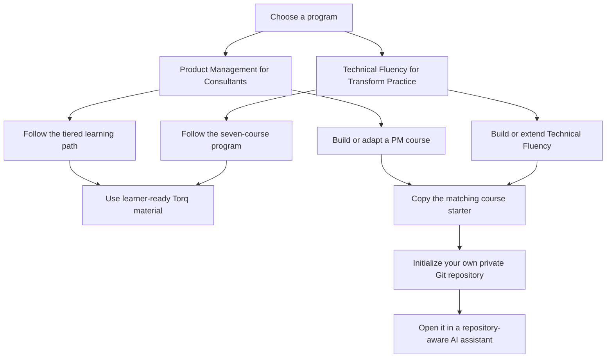

# ProductLearning

ProductLearning is Torq's private, read-only learning library for two independent programs:

1. [Product Management for Consultants](programs/product-management-for-consultants/README.md)
2. [Technical Fluency for Transform Practice](programs/technical-fluency/README.md)

The repository contains captured references, completed Torq lessons, plans for unfinished material, and clean starter workspaces. The source library is evidence—not an editable course workspace. Build in a copied starter, never inside `source-library/`.

## Understand this repository with an AI assistant

Open this repository in a repository-aware assistant and start with this tool-neutral orientation prompt:

```text
I'm a product manager getting oriented to this repository. Do not modify files.
Give me a PM-level tour:
1. What this repository is for in one sentence.
2. How the two programs differ and who each is for.
3. What each major folder contains.
4. Which files are current guidance versus immutable source or history.
5. Where work is complete, partial, or planned.
6. The best next step for [learning / building / continuing Scott's work].
Cite repository paths for every recommendation. If I want to create content,
direct me to a copied course starter.
```

If you want to use AI in product work, start with the [Torq AI workflow prompts](prompt-library/README.md). They work with Claude Code, Codex, Kiro, Cursor, and similar tools. They are Torq-authored working aids—not extracted Product School course content.

## What collaborators should use

| Material | Use it now? | Purpose |
|---|---|---|
| Completed Torq Product Practice lessons | **Yes** | Learner-ready product-management curriculum |
| Completed Technical Fluency lessons and program map | **Yes** | Learner-ready lessons plus the approved plan for unfinished courses |
| Torq AI workflow prompts | **Yes** | Practical, tool-neutral support for approved client work |
| Product School captures | **No—not as the Torq learning path** | Restricted builder reference for creating future original Torq adaptations |

The presence of a source capture does not make it assigned Torq curriculum. The program guides label what is completed, planned, or reference-only.

## Use AI on a client engagement

Start with the client outcome—not “teach me the Claude Code course.” The practices are transferable across Claude Code, Codex, Kiro, Cursor, and other repository-aware assistants.

| I need to… | Start with… |
|---|---|
| Strengthen core product-management practice | [Product Management for Consultants](programs/product-management-for-consultants/README.md) |
| Understand technology and collaborate with engineers | [Technical Fluency for Transform Practice](programs/technical-fluency/README.md) |
| Use AI for repository orientation, research, PRDs, QA, analysis, or decisions | [Torq AI workflow prompts](prompt-library/README.md) |
| Browse copy-ready prompts for common product tasks | [Starter prompts](STARTER-PROMPTS.md) |
| Get a guided recommendation for a real client outcome | [Use ProductLearning with AI on client work](CLIENT-AI-GUIDE.md) |

Everyday starting prompt:

```text
I need to [CLIENT OUTCOME]. My role is [ROLE], my approved AI tool is [TOOL],
I may use [APPROVED DATA], and I may not share [RESTRICTIONS]. Use ProductLearning
to recommend the smallest relevant completed Torq path and help me produce the
deliverable. Cite the guidance you use, separate evidence from assumptions, and
keep human decisions explicit. Do not use restricted source captures as
learner-facing content.
```

The [starter prompt catalog](STARTER-PROMPTS.md) has copy-ready prompts for learning, repository orientation, research, PRDs, pressure testing, engineering conversations, AI evaluation, decisions, and curriculum building. The [client AI guide](CLIENT-AI-GUIDE.md) contains the full guided intake, Learn / Apply / Build / Lead routes, tool guidance, and a short message you can send when inviting another Torq product person.

New to Codex? Follow [Connect Codex to ProductLearning](CONNECT-CODEX.md). It covers cloning the private library, opening it as a Codex project, asking read-only questions, and moving course-building work into a separate learner-owned repository.

## Start here



| I want to… | Go here |
|---|---|
| Follow the consultant product-management route | [Product Management for Consultants](programs/product-management-for-consultants/README.md) |
| Follow the standalone technical-fluency program | [Technical Fluency for Transform Practice](programs/technical-fluency/README.md) |
| Pick up the curriculum build where Scott stopped | [Pick up here](PICK-UP-HERE.md) |
| See what is current, contradictory, or historical | [Curriculum coherence audit](CURRICULUM-AUDIT.md) |
| Use an AI assistant in product or client work | [Torq AI workflow prompts](prompt-library/README.md) |
| Copy a starter prompt for a common product task | [Starter prompts](STARTER-PROMPTS.md) |
| Get a guided client-work route and starting prompt | [Use ProductLearning with AI on client work](CLIENT-AI-GUIDE.md) |
| Connect Codex and start asking questions | [Connect Codex to ProductLearning](CONNECT-CODEX.md) |
| Understand TorqHub's learning structure | [How Torq learning is structured](TORQ-LEARNING-STRUCTURE.md) |
| Build a PM course from a protected source copy | [PM course starter](course-starters/product-management-consultants/README.md) |
| Build or extend the Technical Fluency course | [Technical Fluency course starter](course-starters/technical-fluency/README.md) |
| Understand what was imported | [Import inventory](IMPORT-INVENTORY.md) |
| Know which captured files to surface | [Source library status](source-library/STATUS.md) |
| Understand source-use restrictions | [Source-use policy](SOURCE-USE.md) |
| Configure safe learner access | [Access and protection](ACCESS.md) |

## Content states

| State | Meaning |
|---|---|
| **Completed** | Torq-branded lesson files exist and can be reviewed or prepared for TorqHub. |
| **Captured** | Source notes and artifacts exist, but a Torq rebuild has not been completed. |
| **Partial** | Some expected source or rebuilt material is missing; the program guide names the gap. |
| **Planned** | A specification or coverage map exists, but lesson files have not been built. |
| **Starter** | A safe, editable workspace intended to be copied into a learner-owned repository. |

## Read-only operating model

The intended model is for selected collaborators to receive **Read** access. They may clone and pull, but should not build directly in the clone or push to this repository. The repository's current GitHub plan does not support private-repository branch protection, so do not add learners until a read-only role can be verified; see [Access and protection](ACCESS.md).

Codex works from a local folder: clone this repository with Git, then open that folder as a Codex project. See the complete [Codex connection guide](CONNECT-CODEX.md).

To create or adapt a course:

```powershell
.\scripts\new-course.ps1 -Program product-management-consultants -Name "My PM Course" -Destination "C:\work\my-pm-course"
```

```bash
./scripts/new-course.sh product-management-consultants "My PM Course" "$HOME/work/my-pm-course"
```

Replace `product-management-consultants` with `technical-fluency` for the other starter. The scripts refuse to overwrite an existing destination, copy only the starter, initialize an independent Git repository, and do not configure a remote.

After creation, open the new folder in your chosen AI assistant and ask:

> Read the repository instructions and source index. Explain the course-building workflow, the sources I can use, and where you are allowed to write.

## Maintainer controls

- Keep the GitHub repository private.
- Grant learners the **Read** role only after the repository is on a GitHub owner/plan that supports granular private-repository permissions.
- Protect `main`, require owner review, and enforce [CODEOWNERS](.github/CODEOWNERS) after branch protection becomes available.
- Do not add a public/open-source license: this repository contains mixed-provenance internal reference material.
