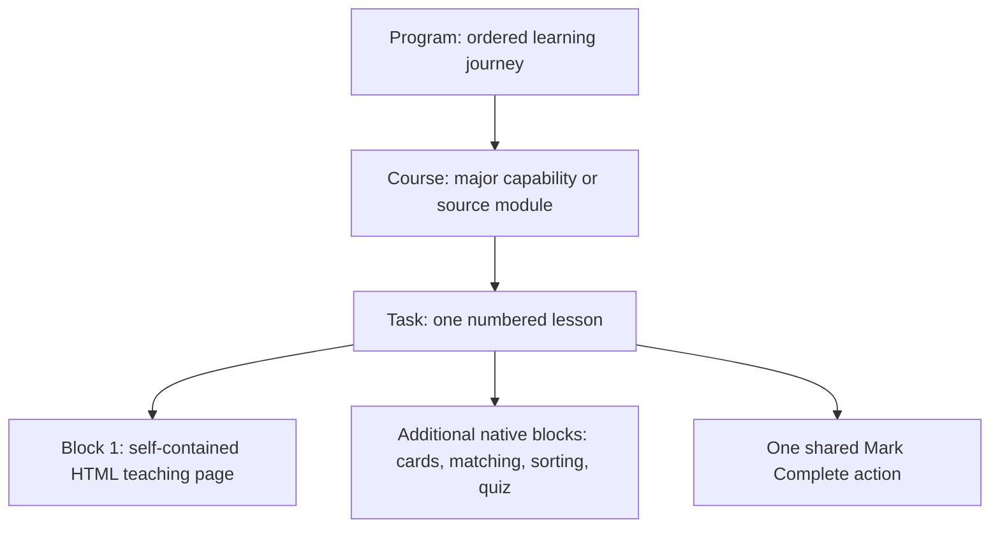
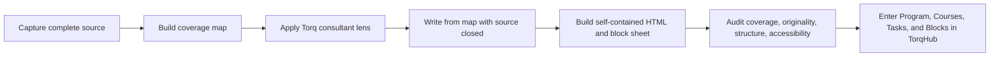

# How Torq learning is structured

This is the shared operating model for turning captured material into Torq learning. It summarizes the existing [TorqHub production guide](<source-library/imports/torq-lessons-build/Torq Lessons Build/Torq Rebuild/_TORQHUB-PRODUCTION-GUIDE.md>), [L&D build method](<source-library/imports/torq-lessons-build/Torq Lessons Build/Torq Rebuild/_LD-BUILD-METHOD.md>), and [build notes](<source-library/imports/torq-lessons-build/Torq Lessons Build/Torq Rebuild/Build/_BUILD-NOTES.md>).

## TorqHub hierarchy

| Level | Meaning in this repository |
|---|---|
| **Program** | The ordered experience learners enroll in. Courses may unlock sequentially. |
| **Course** | A major capability area, normally mapped 1:1 to a source module. |
| **Task** | One numbered lesson inside a course. Some older source files call this a “lesson”; TorqHub calls it a Task. |
| **Block** | Content inside a Task. The self-contained HTML page is the teaching block; native TorqHub blocks add retrieval practice or assessment. |

## Production pipeline

1. **Capture the source.** Preserve notes, glossaries, and artifact digests before rebuilding.
2. **Prove coverage.** Map every teaching section to a Task; task count comes from the map.
3. **Apply the Torq lens.** Reframe for consultants who advise clients, work at different tiers, and must hand off cleanly.
4. **Write clean-room.** Build from the coverage map with source prose closed; preserve concepts and attribution without near-copying prose.
5. **Produce the Task.** Use a self-contained HTML teaching page plus any native TorqHub block instructions required by the program.
6. **Audit before upload.** Recheck coverage after every change and run the applicable structural and de-duplication checks.
7. **Assemble in TorqHub.** A TorqHub administrator creates the Program, Courses, Tasks, HTML blocks, native blocks, and sequencing.

## Shared rules

- Keep source-module structure 1:1 unless a governing program document explicitly records a different decision.
- Tighten prose, never coverage.
- Use real, verifiable examples and preserve attribution.
- Treat AI as an accelerator for synthesis and drafting; human judgment owns scope, accuracy, and final decisions.
- Check the engagement's approved AI tools and data policy before using client information.
- Use the canonical Torq templates and brand rules instead of copying a sibling lesson and allowing visual drift.

## Program-specific differences

| Product Management for Consultants | Technical Fluency |
|---|---|
| Many Tasks end in keepable work artifacts that build toward client-facing deliverables. | No per-task artifact canvases and no JavaScript in Tasks; lessons end at key takeaways. |
| The consultant path combines four course lines differently for Tiers 1–3. | One seven-course program is visible to every tier; the same fact is explained at three altitudes. |
| Several course lines are captured references awaiting Torq rebuilds. | Courses 0–2 are built and Courses 3–6 follow a complete coverage specification. |

## TorqHub assumptions still requiring confirmation

Before a production upload or broad rollout, confirm with the TorqHub owner:

- Whether uploaded HTML is sandboxed in an iframe or injected into TorqHub's page.
- Whether Google Fonts is allowed by the content security policy.
- Whether links/downloads work inside the upload context where a course uses them.
- Who owns Program creation, sequential unlocks, enrollment, and final publishing approval.
