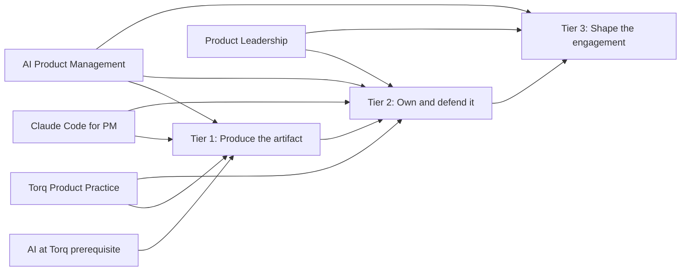

# Product Management for Consultants

This is the consultant product-management program. It is a routing layer across four existing course lines, not a new curriculum that rearranges their modules. Choose the tier matching what the client expects you to produce and defend, then follow that row in order.

Technical Fluency is intentionally separate. Use the [Technical Fluency program](../technical-fluency/README.md) alongside this route when you need stronger technical vocabulary and client-room fluency.

## Program map

Before using AI with client information, complete Torq's AI prerequisite and confirm the engagement's approved tools and data-handling policy.

> **Continuing Scott's work?** Start with the [Product Management build handoff](BUILD-HANDOFF.md). It identifies the existing syllabi, current state of every course line, and the exact next action.

## Choose your route

| Tier | Typical roles | What the client expects | Learning sequence |
|---|---|---|---|
| **Tier 1** | Associate / Sr. Associate | Produce a correct artifact on time with supplied structure. | [Torq Product Practice](#course-lines-and-source-status) Courses 0–4 → [Claude Code for PM](#course-lines-and-source-status) Modules 1–2 → [AI Product Management](#course-lines-and-source-status) Module 1 |
| **Tier 2** | Consultant / Sr. Consultant | Own a workstream, defend the roadmap/spec, and run the readout. | Product Practice Courses 1–6 → Claude Code for PM Modules 3–4 → AI PM Modules 3–4 → Product Leadership Module 4 |
| **Tier 3** | Principal / Associate Director / Director | Shape and extend the engagement; carry risk, money, and executive conversations. | Product Leadership Modules 1, 4, 5, 6 → AI PM Modules 2, 5, 6 → review Product Practice Course 6 and Claude Code for PM Lesson 4.4 |

The evidence and longer rationale for this routing are in the supplied [Torq Consultant Learning Path](<../../source-library/imports/supplemental-library/Torq Consultant Learning Path.md>).

## Course lines and source status

| Course line | Current supplied state | Start here | Build/reference material |
|---|---|---|---|
| **Torq Product Practice** | **Completed:** Course 0 plus Courses 1–6; 37 tasks and 35 named artifacts in the supplied learning-path record. | [Syllabus](<../../source-library/imports/torq-lessons-build/Torq Lessons Build/Torq Rebuild/Syllabus/Syllabus.md>) | [Completed HTML lessons](<../../source-library/imports/torq-lessons-build/Torq Lessons Build/Torq Rebuild/Build/>) · [captured source](<../../source-library/imports/torq-lessons-build/Torq Lessons Build/Source Material/>) |
| **Claude Code for PM** | **Captured:** four modules and 17 lessons; no Torq rebuild supplied. | [Capture source](<../../source-library/imports/claude-code-for-pm/Claude Code For PM/Source Material/>) | [Workspace scaffold](<../../source-library/imports/claude-code-for-pm/Claude Code For PM/pm-workspace/README.md>) |
| **AI Product Management** | **Partial capture:** six modules; session state reports five missing standalone pre-reads; no Torq distillation supplied. | [Session state and gap log](<../../source-library/imports/ai-product-management/AI Product Management/Source Material/_SESSION-STATE.md>) | [Captured source](<../../source-library/imports/ai-product-management/AI Product Management/Source Material/>) |
| **Product Leadership** | **Captured:** six modules; no Torq rebuild supplied. | [Captured source](<../../source-library/imports/product-leadership/Product Leadership/Source Material/>) | [Scoping cross-reference](<../../source-library/imports/supplemental-library/Torq Scoping Response.md>) |

## Where the course lines overlap

Repeated foundations are deliberate. A learner who can demonstrate mastery may skip the repeated explanation, but should still complete the later applied exercise or executive treatment.

| Concept | First taught | Reinforced | Added value later | Safe to skip |
|---|---|---|---|---|
| Core PM execution | [Product Practice](<../../source-library/imports/torq-lessons-build/Torq Lessons Build/Torq Rebuild/Syllabus/Syllabus.md>) | [Product Leadership](<../../source-library/imports/product-leadership/Product Leadership/Source Material/>) | Strategy, roadmapping, influence, financials, and executive pressure | Introductory PM definitions in Leadership; not its leadership exercise |
| Research methods | Product Practice Course 2 | [Claude Code for PM Part 2](<../../source-library/imports/claude-code-for-pm/Claude Code For PM/Source Material/The Streakly Scenario.md#p2-know-your-users>) | Repository-aware synthesis, competitive research, and traceable outputs | Research-method recap; not the Claude workflow |
| PRDs and prototypes | Product Practice Course 4 | [Claude Parts 3–4](<../../source-library/imports/claude-code-for-pm/Claude Code For PM/Source Material/The Streakly Scenario.md#p3-build-and-learn-fast>) and [AI PM M3–4](<../../source-library/imports/ai-product-management/AI Product Management/Source Material/Class 3/>) | Codebase collaboration and verification; AI architecture, UX, and trust gaps | Generic PRD anatomy; not codebase or AI-specific fields |
| Technical AI fluency | [Technical Fluency](../technical-fluency/README.md) | AI PM, Claude Code, and Product Leadership | Product decisions, tool operation, and organizational governance | Definition recap; not the applied decision or governance work |
| Quality | Product Practice acceptance criteria | [Claude QA](<../../source-library/imports/claude-code-for-pm/Claude Code For PM/Source Material/The Streakly Scenario.md#p4l4-qa-and-launch>) and [AI PM evals](<../../source-library/imports/ai-product-management/AI Product Management/Source Material/Class 6/>) | Implementation/handoff readiness versus probabilistic output quality | Repeated definition; neither applied checklist |

See the [curriculum coherence audit](../../CURRICULUM-AUDIT.md) for source contradictions and canonical rebuild decisions, and the [prompt library](../../prompt-library/README.md) for classified prompt assets.

## Learn from it

1. Pick the tier based on current client responsibility, not tenure alone.
2. Read the course lines in the order listed for that tier; do not reorganize source modules.
3. Use completed Torq HTML lessons where present. Treat captures as self-directed reference until a Torq rebuild exists.
4. Keep notes and artifacts in your own workspace. Do not edit `source-library/`.
5. Revisit the next tier only when your engagement scope changes; Tier 2 is a valid destination, not a waiting room.

## Build or adapt a course

Use the [Product Management for Consultants course starter](../../course-starters/product-management-consultants/README.md). It gives you an independent course plan, decision log, progress tracker, output folders, and AI instructions. Copying it into a private Git repository lets an AI assistant read the protected library as reference while keeping new work separate.

Useful program-level references:

- [Torq Consultant Learning Path](<../../source-library/imports/supplemental-library/Torq Consultant Learning Path.md>)
- [Torq Scoping Response](<../../source-library/imports/supplemental-library/Torq Scoping Response.md>)
- [Product Practices](<../../source-library/imports/supplemental-library/Torq - Product Practices.md>)
- [Torq rebuild method](<../../source-library/imports/torq-lessons-build/Torq Lessons Build/Torq Rebuild/_LD-BUILD-METHOD.md>)
- [Torq company context](<../../source-library/imports/torq-lessons-build/Torq Lessons Build/Torq Rebuild/_TORQ-COMPANY-CONTEXT.md>)
- [How Torq learning is structured](../../TORQ-LEARNING-STRUCTURE.md)
