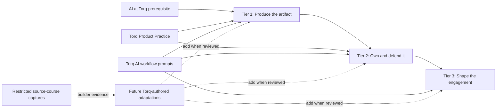

# Product Management for Consultants

This is the consultant product-management program. Today, the learner-ready path is the completed **Torq Product Practice** curriculum plus Torq-authored AI workflow guidance. The Claude Code for PM, AI Product Management, and Product Leadership captures are **restricted builder references for future Torq adaptations**—not three additional Torq courses to assign directly.

Technical Fluency is intentionally separate. Use the [Technical Fluency program](../technical-fluency/README.md) alongside this route when you need stronger technical vocabulary and client-room fluency.

## Program map

Before using AI with client information, complete Torq's AI prerequisite and confirm the engagement's approved tools and data-handling policy.

> **Continuing Scott's work?** Start with the [Product Management build handoff](BUILD-HANDOFF.md). It identifies the existing syllabi, current state of every course line, and the exact next action.

## Choose your route

| Tier | Typical roles | What the client expects | Use now | Planned Torq coverage—not yet assigned |
|---|---|---|---|---|
| **Tier 1** | Associate / Sr. Associate | Produce a correct artifact on time with supplied structure. | [Torq Product Practice](#torq-curriculum-and-reference-inputs) Courses 0–4 + [Torq AI workflow prompts](../../prompt-library/README.md) | Original Torq modules on repository-aware PM work and AI foundations |
| **Tier 2** | Consultant / Sr. Consultant | Own a workstream, defend the roadmap/spec, and run the readout. | Product Practice Courses 1–6 + Torq AI workflow prompts applied to an approved engagement | Original Torq modules on codebase collaboration, AI product design, evaluation, and influence |
| **Tier 3** | Principal / Associate Director / Director | Shape and extend the engagement; carry risk, money, and executive conversations. | Product Practice Course 6 as needed + Torq AI workflow prompts for evidence and decision review | Original Torq modules on AI strategy, operating models, financials, and governance |

The evidence and longer rationale for this routing are in the supplied [Torq Consultant Learning Path](<../../source-library/imports/supplemental-library/Torq Consultant Learning Path.md>). Its references to source-course modules are a build backlog until a Torq-authored version is completed and reviewed.

## Torq curriculum and reference inputs

| Material | State | Learner status | Builder entry point |
|---|---|---|---|
| **Torq Product Practice** | **Completed:** Course 0 plus Courses 1–6; 37 tasks and 35 named artifacts in the supplied learning-path record. | **Learner-ready after TorqHub publishing review** | [Syllabus](<../../source-library/imports/torq-lessons-build/Torq Lessons Build/Torq Rebuild/Syllabus/Syllabus.md>) · [completed HTML lessons](<../../source-library/imports/torq-lessons-build/Torq Lessons Build/Torq Rebuild/Build/>) |
| **Claude Code for PM capture** | Four modules and 17 lessons captured; no Torq rebuild supplied. | **Reference only; do not assign as Torq curriculum** | [Restricted capture](<../../source-library/imports/claude-code-for-pm/Claude Code For PM/Source Material/>) |
| **AI Product Management capture** | Six modules partially captured; five standalone pre-reads are missing; no Torq distillation supplied. | **Reference only; do not assign as Torq curriculum** | [Session state and gap log](<../../source-library/imports/ai-product-management/AI Product Management/Source Material/_SESSION-STATE.md>) |
| **Product Leadership capture** | Six modules captured; no Torq rebuild supplied. | **Reference only; do not assign as Torq curriculum** | [Restricted capture](<../../source-library/imports/product-leadership/Product Leadership/Source Material/>) |

## Where the course lines overlap

This table is a **builder's coherence map**, not a learner assignment. It shows how a future original Torq adaptation can add value without repeating Product Practice.

| Concept | First taught | Reinforced | Added value later | Safe to skip |
|---|---|---|---|---|
| Core PM execution | [Product Practice](<../../source-library/imports/torq-lessons-build/Torq Lessons Build/Torq Rebuild/Syllabus/Syllabus.md>) | [Product Leadership](<../../source-library/imports/product-leadership/Product Leadership/Source Material/>) | Strategy, roadmapping, influence, financials, and executive pressure | Introductory PM definitions in Leadership; not its leadership exercise |
| Research methods | Product Practice Course 2 | Claude Code for PM application layer | Repository-aware synthesis, competitive research, and traceable outputs | Research-method recap; not the repository workflow |
| PRDs and prototypes | Product Practice Course 4 | Claude Code for PM and AI PM application layers | Codebase collaboration and verification; AI architecture, UX, and trust gaps | Generic PRD anatomy; not codebase or AI-specific fields |
| Technical AI fluency | [Technical Fluency](../technical-fluency/README.md) | AI PM, Claude Code, and Product Leadership | Product decisions, tool operation, and organizational governance | Definition recap; not the applied decision or governance work |
| Quality | Product Practice acceptance criteria | Claude QA and AI PM evaluation layers | Implementation/handoff readiness versus probabilistic output quality | Repeated definition; neither applied checklist |

See the [curriculum coherence audit](../../CURRICULUM-AUDIT.md) for source contradictions and canonical rebuild decisions, and the [Torq AI workflow prompts](../../prompt-library/README.md) for original, tool-neutral working aids.

## Follow the current path

1. Pick the tier based on current client responsibility, not tenure alone.
2. Follow the completed Torq Product Practice courses listed for that tier.
3. Use the Torq AI workflow prompts only with engagement-approved tools and data.
4. Keep notes and artifacts in your own workspace. Do not edit `source-library/`.
5. Do not assign a captured source course until a Torq-authored adaptation has been built, reviewed, and marked learner-ready here.

## Build or adapt a course

Use the [Product Management for Consultants course starter](../../course-starters/product-management-consultants/README.md). It gives you an independent course plan, decision log, progress tracker, output folders, and AI instructions. Copying it into a private Git repository lets an AI assistant read the protected library as reference while keeping new work separate.

Useful program-level references:

- [Torq Consultant Learning Path](<../../source-library/imports/supplemental-library/Torq Consultant Learning Path.md>)
- [Torq Scoping Response](<../../source-library/imports/supplemental-library/Torq Scoping Response.md>)
- [Product Practices](<../../source-library/imports/supplemental-library/Torq - Product Practices.md>)
- [Torq rebuild method](<../../source-library/imports/torq-lessons-build/Torq Lessons Build/Torq Rebuild/_LD-BUILD-METHOD.md>)
- [Torq company context](<../../source-library/imports/torq-lessons-build/Torq Lessons Build/Torq Rebuild/_TORQ-COMPANY-CONTEXT.md>)
- [How Torq learning is structured](../../TORQ-LEARNING-STRUCTURE.md)
