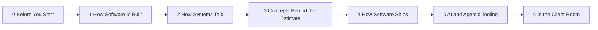

# Technical Fluency for Transform Practice

Technical Fluency is its own standalone program. It is not a module within Product Management for Consultants. It gives consultants enough fluency to understand technical discussions, ask useful questions, and recognize delivery and commercial implications—without pretending that recognition creates engineering authority.

The program is non-gated: every learner can see the Tier 1, Tier 2, and Tier 3 interpretation of the same technical facts.

> **Continuing Scott's work?** Start with the [Technical Fluency build handoff](BUILD-HANDOFF.md). The Program Spec is the syllabus; the handoff identifies the exact next unbuilt Task.

## Seven-course map

| Course | Tasks | Supplied state | Source or build location |
|---|---:|---|---|
| **0 — Before You Start** | 4 | **Completed** | [Built lessons](<../../source-library/imports/technical-fluency-build/Technical Fluency Build/Build/Course 0 - Before You Start/>) |
| **1 — How Software Is Built** | 5 | **Completed** | [Built lessons](<../../source-library/imports/technical-fluency-build/Technical Fluency Build/Build/Course 1 - How Software Is Built/>) |
| **2 — How Systems Talk** | 6 | **Completed** | [Built lessons](<../../source-library/imports/technical-fluency-build/Technical Fluency Build/Build/Course 2 - How Systems Talk/>) |
| **3 — The Concepts Behind the Estimate** | 6 | **Planned** | [Coverage map](<../../source-library/imports/supplemental-library/Technical Fluency — Program Spec.md>) |
| **4 — How Software Ships** | 7 | **Planned** | [Coverage map](<../../source-library/imports/supplemental-library/Technical Fluency — Program Spec.md>) |
| **5 — AI and Agentic Tooling** | 7 | **Planned** | [Coverage map](<../../source-library/imports/supplemental-library/Technical Fluency — Program Spec.md>) |
| **6 — In the Client Room** | 4 | **Planned** | [Coverage map](<../../source-library/imports/supplemental-library/Technical Fluency — Program Spec.md>) |

The complete design is **7 courses, 39 tasks, approximately 95 TorqHub blocks, and no saved task artifacts**. The supplied build currently contains the first 15 lesson HTML files across Courses 0–2.

## Reinforcement and adjacent programs

| Concept | First taught | Reinforced | Added value later | Safe to skip |
|---|---|---|---|---|
| CSS | [Course 1](<../../source-library/imports/technical-fluency-build/Technical Fluency Build/Build/Course 1 - How Software Is Built/>) as a language | Frontend/backend split | Connects syntax vocabulary to where presentation work lives | The second definition after mastery; keep the context comparison |
| REST and CRUD | [Course 2](<../../source-library/imports/technical-fluency-build/Technical Fluency Build/Build/Course 2 - How Systems Talk/>) | Data-system discussions | Maps API verbs to operations on stored data | Definition recap; keep the cross-reference |
| AI vocabulary and implications | Technical Fluency Course 5 plan | [AI Product Management](../product-management-for-consultants/README.md), Claude Code for PM, and Product Leadership | Product decisions, tool operation, and organizational governance | Vocabulary recap after mastery; not later applied work |
| QA and delivery implications | Technical Fluency Course 4 plan | Product Practice and Claude Code for PM | Turns recognition into acceptance criteria, verification, and handoff practice | Recognition recap; not applied QA |

Technical Fluency supplies vocabulary and implications; it does not replace the later course's product decision, operating, or governance exercise. See the [curriculum coherence audit](../../CURRICULUM-AUDIT.md) for the cross-program map.

## Learn from it

1. Start with Course 0 to understand the fluency ladder and tier framing.
2. Follow Courses 1–6 in order. Courses 3–6 currently use the reference guide and program specification until lesson files are built.
3. Use the same facts at three altitudes:
   - Tier 1 recognizes the term and asks a grounded question.
   - Tier 2 discusses delivery trade-offs with the team.
   - Tier 3 connects the same fact to risk, staffing, cost, and commercial scope.
4. Follow the program's central rule: fluency buys the right to ask a better question; it does not buy an unsupported opinion about a client's architecture.

## Primary references

- [Technical Fluency program specification](<../../source-library/imports/supplemental-library/Technical Fluency — Program Spec.md>)
- [Technical Fluency reference guide](<../../source-library/imports/supplemental-library/Technical Fluency Reference Guide.md>)
- [Course-session prompts](<../../source-library/imports/supplemental-library/Technical Fluency — Course Session Prompts.md>)
- [Built Courses 0–2](<../../source-library/imports/technical-fluency-build/Technical Fluency Build/Build/>)
- [Tiered task template](<../../source-library/imports/technical-fluency-build/Technical Fluency Build/_TASK-TEMPLATE-TIERED.html>)
- [Shared L&D build method](<../../source-library/imports/torq-lessons-build/Torq Lessons Build/Torq Rebuild/_LD-BUILD-METHOD.md>)
- [How Torq learning is structured](../../TORQ-LEARNING-STRUCTURE.md)

## Build or extend the program

Use the [Technical Fluency course starter](../../course-starters/technical-fluency/README.md). Begin with Course 3 unless the course plan explicitly records a repair to existing Courses 0–2. New work belongs in the copied starter's `modules/` and `outputs/`, never in the protected source library.
