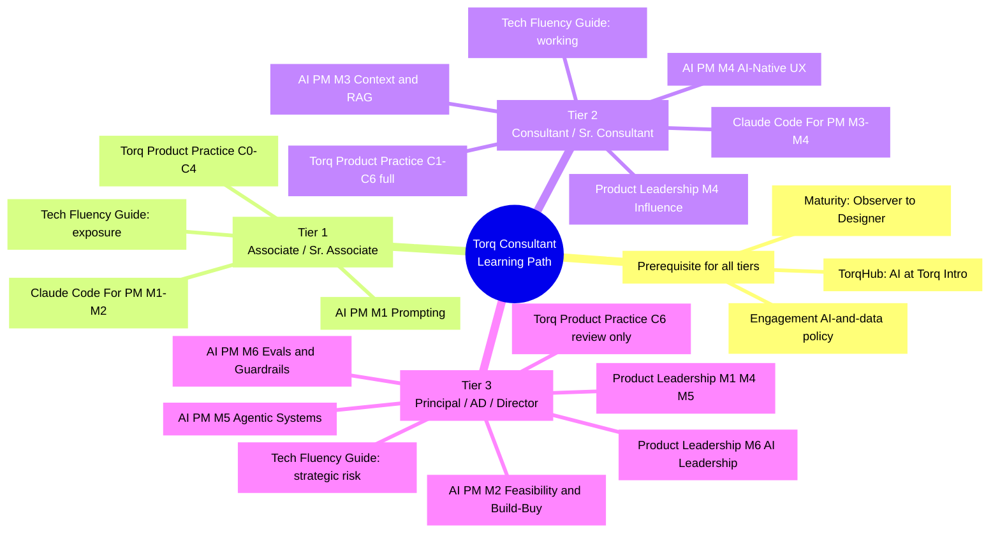
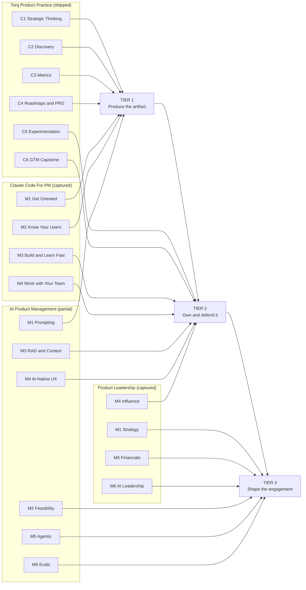

# Torq Consultant Learning Path

**A cross-reference, not a new curriculum.** This file maps how the four existing course lines in this folder combine into one path per consulting tier. It creates no lessons, moves no modules, and edits no existing content — per [`_LD-BUILD-METHOD.md`](PMC/Torq%20Lessons%20Build/Torq%20Rebuild/_LD-BUILD-METHOD.md) Part 4 §5, thematic restructuring of built curriculum has already cost four rebuild rounds on this project. Everything below is a reading order laid *over* the existing structures, which stay 1:1 with their sources.

**Built:** 2026-08-27. **Verified against:** actual captured module contents in each course folder, not catalog descriptions. **Updated 2026-08-27:** §2a–§2d added, folding in the tier-model findings from [`Cracking the PM Career — Source Notes.md`](Cracking%20the%20PM%20Career%20—%20Source%20Notes.md), which was researched after this file's first draft. Tier definitions themselves are unchanged — the book corroborated them rather than revising them.

---

## 1. The four course lines, as they actually exist today

Two of the four are shipped Torq content. Two are captured source material that has not been rebuilt yet. That distinction drives everything below, so it goes first.

| Line | Folder | Real structure (verified) | Build state |
|---|---|---|---|
| **Torq Product Practice** | `PMC/Torq Lessons Build/Torq Rebuild/` | Course 0 orientation + Courses 1–6, 37 tasks, 35 artifacts | ✅ **Shipped.** Torq-branded HTML, clean-room rewritten, n-gram verified |
| **AI Product Management** | `AI Product Management/` (captures) + `AI-PM-Cert/` (raw decks) | 6 modules: M1 Prompting · M2 AI Strategy & Feasibility · M3 RAG / Context Engineering · M4 AI-Native UX · M5 Agentic Systems · M6 Evals & Guardrails | 🟡 **Partial.** Fully captured. `AI-PM-Cert/Torq-Distillation/` holds Torq-branded artifacts for **M1–M3 only** — M4–M6 have no Torq distillation yet |
| **Claude Code For PM** | `Claude Code For PM/` | **4 modules**, 17 lessons: M1 Get Oriented (1.1–1.5) · M2 Know Your Users (2.1–2.4) · M3 Build and Learn Fast (3.1–3.4) · M4 Work with Your Team (4.1–4.4) | 🔴 **Captured only.** No Torq rebuild exists |
| **Product Leadership** | `Product Leadership/` | **6 modules**: M1 Advanced Product Strategy · M2 Prioritization & Roadmapping · M3 Lead & Develop Teams · M4 Alignment & Executive Influence · M5 Product Financials & Strategic Bets · M6 AI Tools for Leadership Execution | 🔴 **Captured only.** No Torq rebuild exists |

> **Practical consequence.** Only Torq Product Practice can be assigned inside TorqHub today. For the other three lines this path is a **reading order against captured source material** — useful for self-directed study and for sequencing the rebuild queue, not yet an enrollable track. Any tier's non-PMC content should be treated as "read the capture" until a rebuild ships.

### Two hypotheses that did not survive verification

The prompt for this file named [`Torq Scoping Response.md`](Torq%20Scoping%20Response.md) and [`_REMIX-OTHER-COURSES.md`](PMC/Torq%20Lessons%20Build/Torq%20Rebuild/_REMIX-OTHER-COURSES.md) as a starting hypothesis. Two claims in them are wrong against the actual captures, and the tier mapping below reflects the corrected version:

1. **Product Leadership is 6 modules, not 4.** `_REMIX-OTHER-COURSES.md` describes a 4-module PLC — *Advanced Strategy → OKRs → Orchestrate Your Product Portfolio (PPM) → Put Everything Together*, drawn from the public catalog page in Aug 2026 and explicitly self-flagged there as unverified marketing copy. The real captured course has **no OKR module and no portfolio-management module.** It runs Strategy → Prioritization & Roadmapping → Leading Teams → Executive Influence → Financials → AI Leadership. That kills the "portfolio thinking without portfolio authority" framing as the organizing idea for a consultant path. The modules that actually earn a consultant's time are **M4 (influence/negotiation) and M5 (financials)** — which is a *better* fit for the "advise, don't own" reframe than the hypothesis was.
2. **The OKR gap is real and confirmed.** `Torq Scoping Response.md` §1 flags "OKRs show up constantly as an input but aren't taught as a standalone lesson." Verified: OKRs appear only as a grid inside the Module 1 Strategy Sprint Builder artifact. There is no OKR lesson anywhere in the four lines.

Everything else in the Scoping Response checked out against the source, including §7's honest gap — nothing in any line teaches how PM artifacts change when engineering is agentic. That gap is called out per-tier below.

---

## 2. The tiering logic

From [`_TORQ-COMPANY-CONTEXT.md`](PMC/Torq%20Lessons%20Build/Torq%20Rebuild/_TORQ-COMPANY-CONTEXT.md): a Torq consultant is staffed onto someone else's already-scoped initiative, has to be credible fast with no ramp, usually advises rather than decides, has to hand off cleanly, and is judged on **client-visible deliverables and readouts** — not on internal product metrics over a multi-year tenure.

Tiers therefore split on **what the client sees you produce and defend**, not on years served:

| Tier | Roles | What the client room asks of them |
|---|---|---|
| **Tier 1** | Associate / Sr. Associate | Produces the artifact. Someone else defends it. Needs to not be the bottleneck in week one. |
| **Tier 2** | Consultant / Sr. Consultant | Owns a workstream end to end. Writes the spec, defends the roadmap, runs the readout, survives the client's pushback in the room. |
| **Tier 3** | Principal / Associate Director / Director | Shapes the engagement. Scopes it, sells the next phase, sponsors the deliverable, carries the risk and the money conversation. |

### 2a. The vocabulary behind the split

The three tiers above were defined first and checked afterward against *Cracking the PM Career* (Bavaro & McDowell, 2021), researched in [`Cracking the PM Career — Source Notes.md`](Cracking%20the%20PM%20Career%20—%20Source%20Notes.md). The book arrives at the same move independently — **level is set by scope, autonomy, and impact, not by a checklist of demonstrable skills** — which is worth adopting as the working vocabulary, because "what the client sees you produce and defend" is a description and this is a set of dials.

- **Scope** — how large and how ambiguous the territory you're responsible for.
- **Autonomy** — how little help you need to succeed inside it.
- **Impact** — what actually shipped, and what it did.

| | Scope | Autonomy | Impact |
|---|---|---|---|
| **Tier 1** | One artifact or workstream slice, handed over already scoped | Needs the structure supplied — a template and a reviewer | The artifact exists, is right, and arrives on time |
| **Tier 2** | A workstream end to end, including its ambiguity | Works from a goal rather than a spec; defends the output in the room | The client changed a decision because of the work |
| **Tier 3** | The engagement, its shape, and its commercial terms | Sets the scope others work inside; is the one being negotiated with | The engagement got extended, or the client's operating model changed |

**The promotion mechanism that follows:** you reach the next tier by demonstrating autonomy and impact **at your current scope**, which earns the trust to be handed a larger one. Not by collecting skills off a rubric.

### 2b. Tier 2 is a destination, not a waiting room

Bavaro is explicit that Senior PM is a legitimate place to stop — a high-performing, independent Senior PM creates real value, and a company is happy to keep one indefinitely. The consulting translation matters here, because **Tier 2 is where most Torq client work actually gets done.** A tier model that reads as "everyone is en route to Tier 3" misdescribes the majority of the population and quietly devalues the tier carrying the engagements.

Related and worth stating plainly: the step from Tier 1 to Tier 2 is a **job change, not a skill upgrade.** Getting better at producing artifacts does not get you to Tier 2; getting better at owning ambiguity and defending a position does. That's why the Tier 2 additions in §4 are all defense skills rather than more execution craft.

### 2c. Observable behaviors, for staffing and coaching

More useful than a rubric, because each row is something a Torq lead can actually watch happen on an engagement:

| | Earlier tier | Later tier |
|---|---|---|
| **Structure** | Needs templates and a preset process | Works without them; supplies them for others |
| **Ambiguity** | Wants the question answered before starting | Comfortable starting with it unsettled |
| **Trade-offs** | Escalates them | Makes them, and defends the reasoning |
| **Direction** | Receives what to work on | Argues for what should be worked on |
| **Optimization frame** | Optimizes their own deliverable | Optimizes across the engagement, and for the long term |
| **Time horizon** | This deliverable | The next several |
| **Team** | Is coached | Has earned decision-making trust and empowers others |

Bavaro also splits PM capability into **five separately-earned currencies** — product, execution, strategic, leadership, and people-management skills — rather than one seniority score. Useful for staffing: a consultant can be strong on execution and still developing on strategy and be genuinely good at their tier. That's a more honest input to a staffing decision than a single number.

### 2d. Two guardrails on writing this down further

1. **Don't turn this into a rubric.** The book's own critique of conventional ladders: they're either too vague to act on ("demonstrates strong judgement") or so specific they get applied inconsistently — and they often just restate the scope someone was already assigned, which makes them circular. The tables above are deliberately behavioral and deliberately short.
2. **The standard PM ladder's third rung is people management. The consulting third rung is not.** Bavaro's phase 3 is *organizational excellence* — hiring, coaching, running the org. Only the **advisor-to-executives** half of that transfers to a Torq Principal advising a client team they don't manage; the manage-the-org half applies to an AD managing Torq consultants and to nobody else. **This is the same call §4 makes independently about Product Leadership M3, reached from a different source.** Any tier model that borrows a standard PM ladder wholesale imports an assumption that doesn't hold here.

> **Where this corroborates §4.** Two of the book's conclusions match calls the tier mapping below already made from the course material alone: PL M3 doesn't transfer (above), and *influence without authority* is the defining Tier 2 skill — Chapter 21's topic, and the reason PL M4 is the one Product Leadership module assigned at Tier 2. Two independent sources landing on the same answer is a signal about where to put weight, not a coincidence worth ignoring.

---

## 3. Mind map

### How the lines stack across tiers

---

## 4. Per-tier recommendations

### Tier 1 — Associate / Sr. Associate

| | |
|---|---|
| **Combination** | **Torq Product Practice Courses 0–4** (complete, in order) → **Claude Code For PM M1–M2** → **AI PM M1 (Prompting)** |
| **Time** | ~1 week for PMC C0–C4 at 20–30 min/day, then ~1 week for the CC4PM and AI PM additions |
| **Skip for now** | Product Leadership entirely · PMC C5–C6 (revisit at Tier 2) · AI PM M2–M6 |

**Why this combination.** A Tier 1 consultant's failure mode is being staffed on Monday and still ramping on Friday. Torq Product Practice C0–C4 is the only line here that is (a) already shipped in TorqHub, (b) explicitly weighted 80% execution, and (c) built so every one of its tasks ends in a keepable artifact — a discovery filter, a metric-selection worksheet, a roadmap, a scored backlog, a PRD, an acceptance-criteria set. That artifact set *is* the Tier 1 job description. C1–C4 stop exactly where the client-facing defense starts, which is the right cut line for someone who produces the deliverable but doesn't yet own the room.

CC4PM M1–M2 is bolted on because it does one thing no PMC course does: it turns raw client material into a structured first draft fast. M1 sets up persistent context so the consultant isn't re-explaining the engagement to a model every session; M2 (2.1–2.4) covers interview synthesis, large feedback sets, competitive analysis, and the one-page decision brief. On an engagement where the client hands over 40 interview transcripts on day two, that is the difference between credible-in-week-one and not. Pair it with PMC C2, which teaches the discipline that keeps it honest — *AI compressed the synthesis, not the judgment.*

AI PM M1 is included at the lesson level rather than the module level: prompt anatomy and system-prompt configuration are the floor for using any of the above well. M2–M6 of that line are feasibility, architecture, and governance decisions a Tier 1 consultant will not be making.

**Deliberately excluded: Product Leadership.** All six PL modules assume standing authority — direct reports, a budget line, a portfolio, an executive audience that already reports to you. A 3–5-year consultant embedded on a client team has none of those. Introducing PL here teaches a posture the tier can't actually take in the room.

> **Technical Fluency Reference Guide — Tier 1 plug-in.** ✅ Built 2026-08-27: [`Technical Fluency Reference Guide.md`](Technical%20Fluency%20Reference%20Guide.md). Slots in **before** CC4PM M1 as **broad-exposure framing**: what each term is, why it's used, one real example. Goal is narrow and testable — no Tier 1 consultant hears "cron job," "CRUD," "JSON," or "React Native" for the first time while a client engineer is talking. Not "learn to code." **Tier 1 read: the master table (§2) only.**

---

### Tier 2 — Consultant / Sr. Consultant

| | |
|---|---|
| **Combination** | **Torq Product Practice C1–C6 complete** (adds C5 Experimentation + C6 GTM capstone) → **Claude Code For PM M3–M4** → **AI PM M3 (RAG / context engineering) + M4 (AI-Native UX)** → **Product Leadership M4 (Alignment & Executive Influence)** |
| **Time** | ~2 weeks PMC completion + rebuild-dependent for the rest |
| **Skip for now** | PL M1/M2/M3/M5 · AI PM M2/M5/M6 |

**Why this combination.** This is the tier that gets the pushback. The client's engineering lead says the spec is ambiguous; the client's director says the roadmap is wrong; the client's data person says the metric doesn't mean what the readout claims. Every addition here is a defense skill.

**PMC C5 and C6** finish the arc C1–C4 started. C5 turns an opinion into a testable claim and — critically — teaches reading results honestly and making the ship/iterate/kill call. C6's capstone assembles all six courses' artifacts into a single client-readout-ready deck, which is the literal Tier 2 deliverable. A Tier 2 consultant who has done C1–C4 but not C6 has the parts and not the readout.

**CC4PM M3–M4** is where this line stops being a productivity tool and starts being a client-room skill. M3 (3.1–3.4) is the disciplined prototype loop — a precise PM brief, rapid 1-to-1.n iteration, and an explicit rule that when the prototype is wrong the *brief* was wrong. M4 (4.1–4.4) is the more valuable half for Torq: reading a codebase without writing code, pairing with engineering, pairing with design, and 4.4's spec-readiness checklist plus PM QA. `Torq Scoping Response.md` §2 correctly identifies spec-readiness as the step most PM curricula skip — it's also the step that determines whether a Torq handoff survives after Torq leaves, which `_TORQ-COMPANY-CONTEXT.md` names as a core constraint.

**AI PM M3 and M4** are the two modules of that line a Tier 2 consultant actually uses. M3's core claim — engineers own retrieval mechanics, **PMs own what should be retrieved and why** — is a client-room ownership boundary, not a technical topic, and it's the single most transferable idea in the AI PM line for someone advising a client's AI build. M4 (trust gaps, confidence cues, escape hatches, invisible-by-default UX) is what lets a consultant critique a client's AI feature without hand-waving. Both have Torq distillation available for M3; M4 does not yet.

**Product Leadership M4** is the one PL module that works *without* authority, which is why it's the only one here. It teaches the split between formal power (the org chart, who must sign off) and informal power (who the decider calls before the meeting) — and that is precisely the skill of an outsider staffed onto a client org for twelve weeks who has to find the real decision path fast. M4's negotiation and hard-call sections translate directly. The other PL modules do not, at this tier.

> **Regulated client?** Tier 2 carries most of the compliance exposure, because it's the tier writing the spec and running the experiment. Anything in PMC C5 (experimentation on live users) or AI PM M3 (what client data goes into a retrieval corpus) needs the standard callout from `_TORQ-COMPANY-CONTEXT.md` — legal/compliance review, longer approval cycle, data-handling constraints — before it runs the way the lesson describes.

> **Technical Fluency Reference Guide — Tier 2 plug-in.** ✅ Built 2026-08-27: [`Technical Fluency Reference Guide.md`](Technical%20Fluency%20Reference%20Guide.md). Slots in **alongside CC4PM M4** as **working-fluency framing**: enough depth to discuss trade-offs, not just recognize terms. This is the tier the guide matters most for — CC4PM 4.1 asks the consultant to read a real codebase and 4.2 to pair with engineering, and both assume a vocabulary floor the guide is meant to supply. Category deep-dives (§3–§11, especially frontend, backend, data, delivery, and AI/agentic tooling) plus the client-room phrasebook (§12) are the Tier 2 read.

---

### Tier 3 — Principal Consultant / Associate Director / Director

| | |
|---|---|
| **Combination** | **Product Leadership M1 (Strategy) + M4 (Influence) + M5 (Financials) + M6 (AI Leadership)** → **AI PM M2 (Feasibility & Build/Buy) + M5 (Agentic Systems) + M6 (Evals & Guardrails)** → **PMC C6 and CC4PM 4.4 as review, not build** |
| **Time** | Self-directed; this is reference-and-refresh, not a linear course |
| **Skip for now** | PMC C1–C5 as coursework (know what's in them to coach against) · PL M3 unless managing Torq ICs · CC4PM M1–M3 |

**Why this combination.** Tier 3 is where the engagement gets shaped, sold, and defended to someone who controls the budget. `_TORQ-COMPANY-CONTEXT.md` notes that some real content — how an engagement gets scoped into an SOW, who signs off on launch budget — sits at exactly this level, and the PMC syllabus deliberately teaches it "one level up, never gatekept" via short callouts. Tier 3 is where those callouts stop being callouts and become the actual job.

**Product Leadership finally pays off here, and this is the only tier where it does.** M1's Playing to Win cascade and its three vision tests (*why now / why us / why us now*) are the language of a scoping conversation with a client executive. M5 is the highest-leverage module in this entire folder for Tier 3: it teaches answering "what does this return, and when" in financial terms and holding that number under questioning — the exact moment a Torq engagement gets extended or doesn't. M4 repeats from Tier 2 at a different altitude: at Tier 2 you're finding the power map, at Tier 3 you're the one being negotiated with. M6 (AI as something you *lead* rather than use — personal productivity → team capability → governance) matches the AD/Director job of setting how a whole Torq team uses AI on client work.

**PL M3 (Lead & Develop Teams) is conditionally included, not core.** It's written for a leader with direct reports. That's real for an AD managing Torq consultants and largely fictional for a Principal advising a client's team they don't manage. Read it if you manage Torq people; skip it if your "team" is the client's.

**AI PM M2, M5, M6 are the risk-and-money modules of that line.** M2 is the build/buy/fine-tune decision and the fake-good vs. boring-killer filter — a scoping-conversation tool, not an execution one. M6's 95% accuracy trap (1,000 triages/day × 5% wrong = 50 wrong outputs daily, some silently wrong) is the single most useful thing in the folder for pushing back on a client's AI ambitions with a number instead of a caution. M5's Agent Workflow Spec is the artifact pattern for specifying agentic systems.

**PMC C6 and CC4PM 4.4 as review.** Tier 3 doesn't need to build the GTM plan, but does need to recognize a weak one and coach the Tier 2 who wrote it. Likewise CC4PM 4.4 — its Anthropic Bun-rewrite example (roughly 15% of effort writing code, 85% verification) is the evidence base for the strategic claim that PM leverage is shifting toward verification.

> **Named gap, per `Torq Scoping Response.md` §7.** No module in any line answers *how product roles and artifacts change when engineering is increasingly agentic.* Verified — the ingredients exist (CC4PM 4.4's Bun rewrite + AI PM M5's Agent Workflow Spec / Agent Control Panel), the synthesis does not. This is a Tier 3 conversation happening in client rooms now and it has no home in the curriculum. Flagging, not building — the honest state is "next module to build," exactly as the Scoping Response says.

> **Second named gap: OKRs.** No standalone OKR lesson exists in any of the four lines, despite OKRs being an input to PL M1's strategy cascade, PMC C3's outcome hierarchy, and PMC C4's roadmap formats. Tier 3 feels this most, since OKR-setting is the altitude they advise at.

> **Technical Fluency Reference Guide — Tier 3 plug-in.** ✅ Built 2026-08-27: [`Technical Fluency Reference Guide.md`](Technical%20Fluency%20Reference%20Guide.md). Slots in as **strategic/risk framing** — same underlying facts as Tiers 1 and 2, different "why this matters to you." At this tier the question isn't what React is, it's what a client's stated stack implies about delivery risk, hiring, vendor lock-in, and whether the SOW estimate is credible. Read as the master table (§2) plus each deep-dive's "Strategic & risk read" column, then §13's four-step system read — not the mechanics columns.

---

## 5. Cross-cutting prerequisite for every tier

`_REMIX-OTHER-COURSES.md` records a resolved finding worth surfacing here: Torq already runs a live TorqHub course, **"AI at Torq Intro"** (`gotorqhub.com/learning/36`), carrying the real engagement-level AI and client-data policy — *confirm the engagement's policy and approved tools before using client information* — plus Torq's canonical AI point of view (*"People are the edge. AI sharpens it."*) and the four-level maturity model **Observer → Passenger → Driver → Designer**.

Every tier's path above involves putting client material in front of a model. That course is the prerequisite for all three, at every tier, and none of the four course lines duplicates its policy content. A consultant who has not taken it should not start the CC4PM or AI PM portions of any tier.

This also gives Torq a shared vocabulary the tiers can be described in without inventing a parallel framework: Tier 1 is roughly getting to **Driver**, Tier 2 operates as a Driver, Tier 3 is expected to be a **Designer**.

---

## 6. Sequencing note for the rebuild queue

This path implies a build priority that differs from the order the source material was captured in. If the intent is to make these tiers actually assignable in TorqHub, the highest-value rebuilds are, in order:

1. **Claude Code For PM M4** (Work with Your Team) — needed by Tier 2, the largest population, and it's the only content covering spec-readiness and PM QA
2. **AI PM M3–M4** — Tier 2; M3 already has partial Torq distillation to build from
3. **Product Leadership M4 + M5** — the two PL modules that carry Tiers 2 and 3; skips the four PL modules no tier currently needs first
4. **AI PM M2 + M6** — Tier 3 risk and feasibility
5. **Claude Code For PM M1–M2** — Tier 1; valuable but the captured notes are usable as-is in the interim

That order is derived from the tier mapping above, and it deliberately does **not** rebuild any line 6-for-6 before starting the next. Note that this is a *build-queue* recommendation only — it does not change any course's internal 1:1 structure with its source, which `_LD-BUILD-METHOD.md` Part 4 §5 requires stay intact.

---

## 7. What this file is not

- Not a restructuring of any course. Every line keeps its own module order and its 1:1 mapping to its source.
- Not new teaching content. Nothing here is a lesson; it's a routing layer.
- Not a replacement for the syllabus. [`Syllabus.md`](PMC/Torq%20Lessons%20Build/Torq%20Rebuild/Syllabus/Syllabus.md) remains the authority on Torq Product Practice's own structure.
- Not enrollable yet, outside Torq Product Practice. See the build-state table in §1.
- **Not a competency rubric.** §2a–§2c describe observable behavior for staffing and coaching conversations. Per the guardrail in §2d, turning them into a scored ladder is explicitly *not* the intent.

---

## 8. Related files

- [`Technical Fluency Reference Guide.md`](Technical%20Fluency%20Reference%20Guide.md) — the technical-vocabulary layer that plugs into all three tiers
- [`Cracking the PM Career — Source Notes.md`](Cracking%20the%20PM%20Career%20—%20Source%20Notes.md) — the research behind §2a–§2d. Reconstructed from licensed excerpts, author interviews, and publisher listings; the book itself was never read, and that file carries its own per-claim confidence ratings
- [`Torq Scoping Response.md`](Torq%20Scoping%20Response.md) — the capability-area mapping this file was checked against, including the two gaps confirmed in §4
- [`_TORQ-COMPANY-CONTEXT.md`](PMC/Torq%20Lessons%20Build/Torq%20Rebuild/_TORQ-COMPANY-CONTEXT.md) — consultant audience framing
- [`_LD-BUILD-METHOD.md`](PMC/Torq%20Lessons%20Build/Torq%20Rebuild/_LD-BUILD-METHOD.md) — the build discipline this file follows

### Still unmined

`Cracking the PM Career — Source Notes.md` §3 flags **Chapter 8, Technical Skills** — a PM-level tour of APIs, deployment, SQL, and cost estimation — as a live cross-reference for [`Technical Fluency Reference Guide.md`](Technical%20Fluency%20Reference%20Guide.md). It corroborates *Tech Simplified* on deployment and SQL, which is useful precisely because those notes are the weaker of the two. Not yet folded into the guide.

Three open verification questions also remain in that file's §3: chapter numbering past 32, whether Ch 32 contains an explicit per-level scope/autonomy/impact table (which would be the most directly transferable asset in the book), and the "elevator test," which rests on a single third-party summary.
